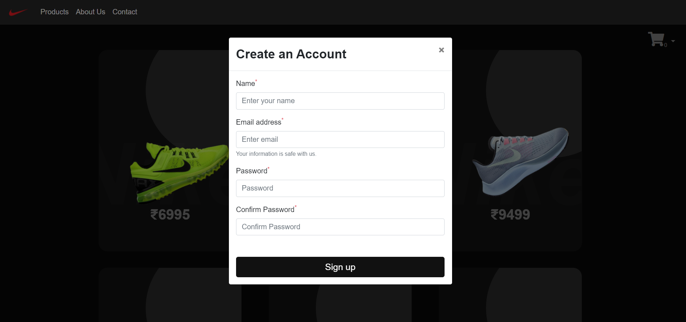
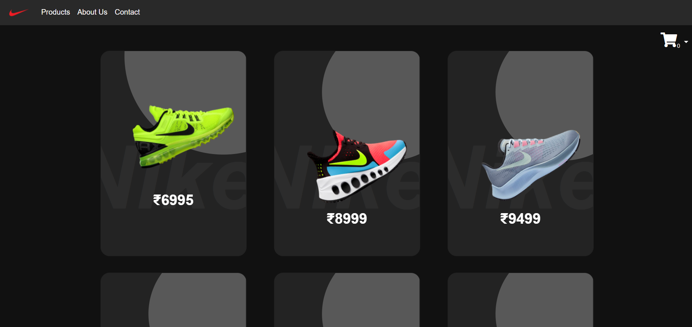
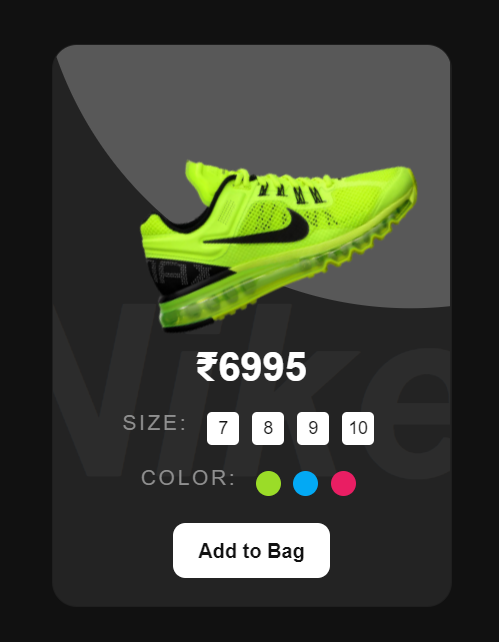
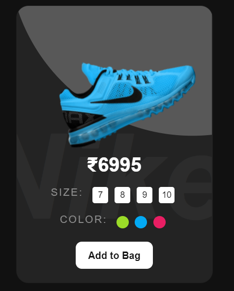
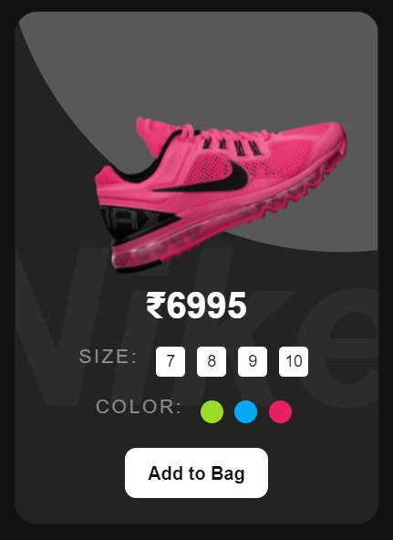
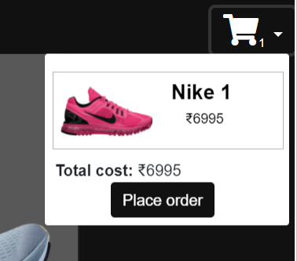
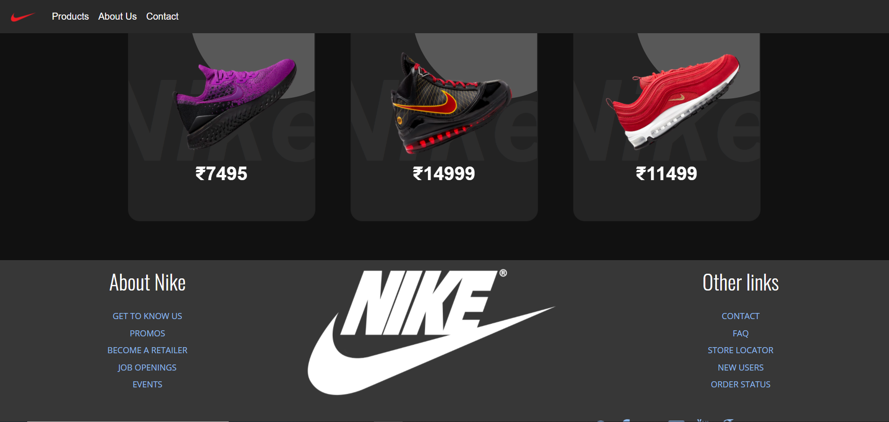

# nike.com
http://mmuazam98.github.io/nike.com
<h2 align= "left"><b>Tech Stack Used</b></h2>

*WEB*

- HTML5
- CSS
- Bootstrap
- jQuery

 &ensp;
 &ensp;
 &ensp;
 &ensp;
 &ensp;
 &ensp;
 &ensp;

